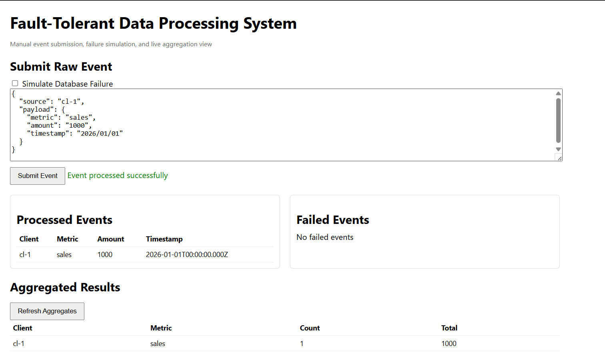
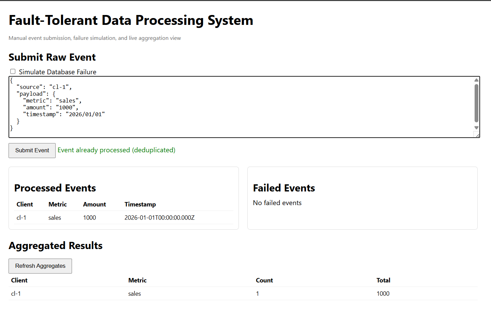
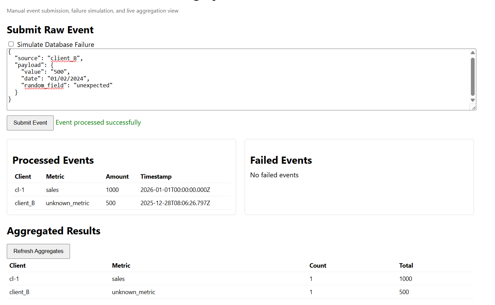
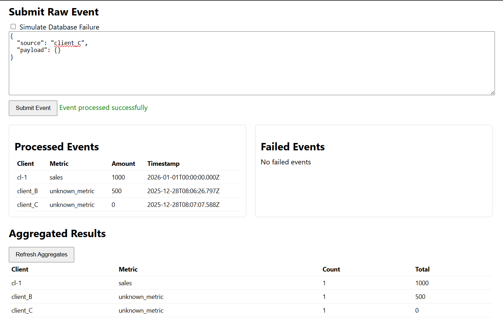
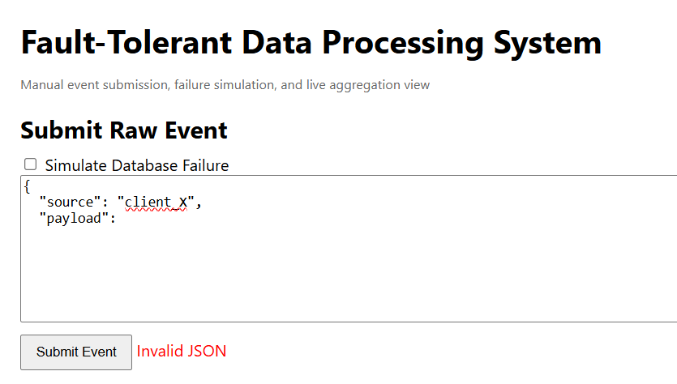
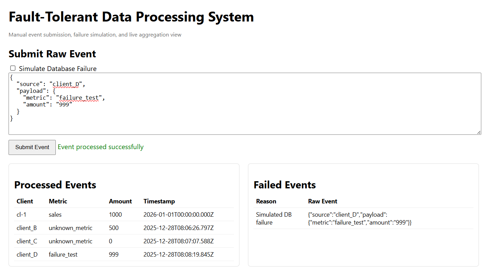

# 🛡️ Fault-Tolerant Data Ingestion System

A robust event processing system demonstrating **deduplication**, **schema flexibility**, **failure handling**, and **safe retries**.

## 🚀 Quick Start

```bash
npm install
npm start
```

Open **http://localhost:3000** to access the testing dashboard.

---

## Test Suite: 7 Critical Scenarios

### TEST 1 — Happy Path (Valid Event)

**Input:**
```json
{
  "source": "client_A",
  "payload": {
    "metric": "sales",
    "amount": "1000",
    "timestamp": "2024/01/01"
  }
}
```

**Expected:** ✅ Event processed successfully → Appears in **Processed Events** → **Aggregates** updated

**Proves:** Normal ingestion, normalization, and end-to-end flow



---

### TEST 2 — Deduplication / Idempotency

**Action:** Submit the **same JSON** again

**Expected:** ✅ "Event already processed (deduplicated)" → ❌ No duplicate row → ❌ Aggregate unchanged

**Proves:** Hash-based deduplication prevents double counting



---

### TEST 3 — Schema Drift (Unreliable Client)

**Input:**
```json
{
  "source": "client_B",
  "payload": {
    "value": "500",
    "date": "01/02/2024",
    "random_field": "unexpected"
  }
}
```

**Expected:** ✅ Event processed → Defaults applied (`metric: unknown_metric`) → ❌ No crash

**Proves:** Schema flexibility handles unknown fields gracefully



---

### TEST 4 — Missing Fields

**Input:**
```json
{
  "source": "client_C",
  "payload": {}
}
```

**Expected:** ✅ Event processed → Defaults applied (`amount: 0`, `timestamp: server time`)

**Proves:** Defensive programming handles incomplete data



---

### ❌ TEST 5 — Invalid JSON (Frontend Validation)

**Input:**
```json
{
  "source": "client_X",
  "payload":
```

**Expected:** ❌ "Invalid JSON" → No API call → No DB write

**Proves:** Client-side validation prevents bad requests



---

### TEST 6 — Simulated Database Failure

**Input:**
```json
{
  "source": "client_D",
  "payload": {
    "metric": "failure_test",
    "amount": "999"
  }
}
```

**Action:** ✅ Check **Simulate Database Failure**

**Expected:** ❌ Error shown → Appears in **Failed Events** → ❌ Not in Processed Events

**Proves:** Partial failure handling without inconsistent state

---

### TEST 7 — Retry After Failure

**Action:** Uncheck **Simulate Database Failure** → Submit **same event**

**Expected:** Event processed successfully → Appears in **Processed Events** → No duplication

**Proves:** Safe retries and eventual consistency



---

## Architecture

- **Deduplication:** SHA-256 hash-based event fingerprinting
- **Normalization:** Flexible schema mapping with intelligent defaults
- **Storage:** LowDB (JSON file-based database)
- **Frontend:** Vanilla JavaScript + Express static serving
- **Failure Handling:** Separate failed events queue for observability


---

## Key Features

✅ **Idempotent Ingestion** — Retry-safe event processing  
✅ **Schema Flexibility** — Handles unreliable clients  
✅ **Failure Isolation** — Failed events don't block system  
✅ **Real-time Aggregation** — Live metrics by client & metric type  
✅ **Full Observability** — Separate queues for processed/failed events
|

---

